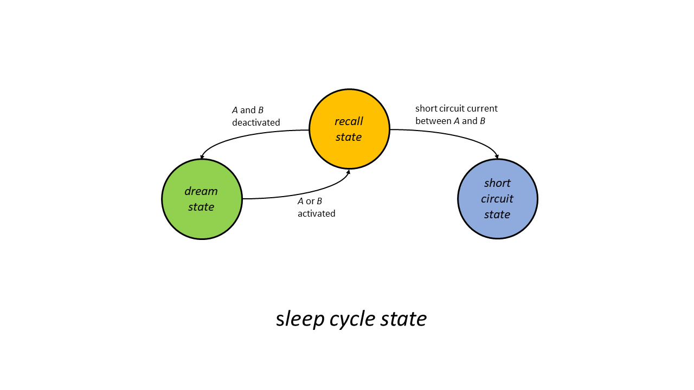
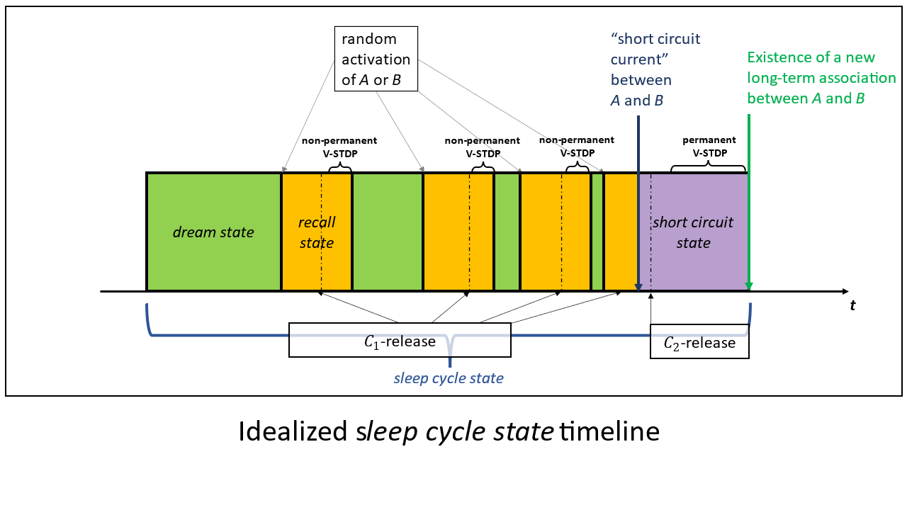
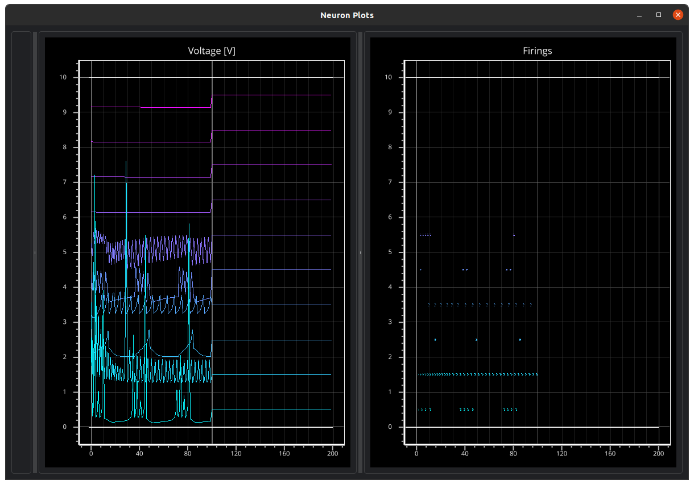

# Pheromonal Spatial Neural Networks

We propose to utilize the volume surrounding a spatially extended network as an information buffer. 

## Idea 2: Formal/Minimalistic Formulation / "Pheromonal less-traveled Pathfinding in spatial Networks"

Components:

1. ANN (Reservoir + Patter Layer)
2. Node Associations
3. Nodes may modify the volume locally and non-permanently. 
4. Problem: Build associations without destroying exiting ones, 
"as decentralized as possible/ with minimal global knowledge". 

Parametrized Components:

1. Network Construction:
   1. Neuron Positions 
   2. Synapse Existence Probabilities 
   3. Initial synaptic weights
   4. Neuron activation function
   5. Definition of Association
   6. Construction of Existing Associations 
   7. Pattern Layer (size + connectivity + activation function + additional activation restrictions)
   
2. Path Finding
   1. Synapse choice
   2. short-term Synaptic weight changes
   3. long-term synaptic weight changes
   4. Neurons choice (via similarity measurement on the Pattern Layer)
   5. Pheromone diffusion 
   6. Pheromone lifetime

### Network Construction

$$ 
\begin{aligned} N &:= \text{number of neurons}, \\ 
S &:= \text{number of synapses per neuron}. \end{aligned}
$$

Neurons Positions: Uniformly distributed in a $1 \times 1 \times 1$ Volume.

Synapse Existence Probability:
For neurons $n_0, n_1$, the probability of the existence of a synapse 
from $n_0$ to $n_1$ is 

$$
\mathbb{P}(n_0, d) \approx -a_{n_0} * d^2 + b_{n_0} \text{ such that } 
\mathbb{E}[\text{"number of synapses of } n_0 \text{"}] \approx S,
$$

with $a_{n_0}, b_{n_0} > 0$.

Activation Functions: ReLu.

Pattern Layer Size: $P \approx \frac{N}{ \sqrt{N} }$, dimensions: $\sqrt{P} \times \sqrt{P}$.

...

[//]: # (![ann0]&#40;./docs_src/readme_images/ann_process/ann_5.svg&#41;)

## Idea 1: Proposal for an Ant Colony Optimization-like Mechanism for the Association of distant neuronal Assemblies of spatially extended spiking neural Networks

By combining the concepts related to neurovascular coupling, STDP modulation via chemical concentrations, 
the concept of neural concept cell assemblies,
we design a mechanism capable of solving a special case of the 
following 'associativity problem':

    In a spatially extended spiking neural network, associate two chosen, distant subnetworks, 
    i.e. increase the strength of synaptic paths between them, such that:
    (1) high firing rates of neurons of one assembly can reliably cause high firing rates in
        the other subnetwork and vice versa,
    (2) a selection of already existing associations may not be significantly altered.

Similarly to Ant Colony Optimization algorithms ([youtube](https://www.youtube.com/watch?v=emRXBr5JvoY)),
the suggested solution will entail locally restricted modifications of network properties. 
Instead of letting agents leave pheromone trails from one point of 
interest to another, we make use of a vascular-like porous flow network to distribute 
chemical particles in the finite volume occupied by the neural network. 
Uneven distributions of chemical concentrations are generated by allowing 
firing neurons to locally increase the delivery rate of chemicals relative to
the delivery rates in the vicinity of neurons with lower firing rates.
Visually, we intended to create the impression of spike trains
leaving chemical trails behind them.  

### Network Model 

We consider a spatially extended spiking neural network (**seSNN**) of 
inhibitory and excitatory neurons. 
For synapses of **seSNN**, we include the modeling of distance dependent synaptic delays. 
Additionally, **seSNN** is stateful (see bellow) such that properties of any network 
element, such as synaptic weights or firing thresholds, may be state-dependent.
**seSNN** may consist of distinct non-overlapping functionally specialized subnetworks, 
denoted as _network modules_.   

### Chemicals

When we speak of _**chemicals**_, we mean modeled chemical particles located within 
the volume occupied by **seSNN**.
In the absence of other effects, chemicals diffuse from areas of high concentration 
to areas of low concentration until they are evenly distributed in the surrounding volume.
The presence of chemicals may, among other things, affect STDP-rules, neuron model variables 
or trigger network state transitions. 
Chemicals are generated in _**chemical glands**_. _Chemical glands_ release chemicals when triggered
by the firing of selected neurons.

### Neuron Models and STDP-Rules (V-STDP)

In the following, we conveniently assume the existence of spiking 
neuron models and STDP learning rules such that all further definitions, properties 
and features are valid and implementable. 
We call the required collection of STDP rules **vascular STDP** or **V-STDP**. 
**V-STDP** may modify synaptic weights both permanently and non-permanently,
depending on firing rates or local concentrations of chemicals. 

### Neural Concept Cell Assemblies

We (loosely) define **_neural concept cell assemblies_** (short: _**concept assemblies**_) to be recurrent 
neural subnetworks characterized 
by a high density of neurons and occupying a small volume relative to the volume assigned 
to **seSNN**. 
We say that a concept assembly is **_activated_** during a time interval $i$
if the firing rate of its members does not subceed $r_{nca} > 0$ during $i.$

**(feature 1)** *Concept assemblies* can not stay active indefinitely.

**(feature 2 - Assembly Inhibition)** The activation of a _concept assembly_ significantly reduces the probability 
of the activation of any other _concept assembly_. 

### Activation Patterns

We say that an **_activation pattern_** $A' = A'_{N, F, d, r_0, r_1}$ occurs on a set of neurons 
$N$ during a time interval $i$ of length greater equal $d$, if the firing rate 
of a fixed subset $F \subset N$ does not subceed $r_0 > 0$ and the firing rate of the neurons
in $N \land F^C$ does not exceed $r_1 \geq 0$ during $i.$ 

### Network Modules

The three following listed network modules constitute the neural network of **seSNN**: 

1. _Reservoir_ (**R**): A spatially extended spiking neural network with sensibly chosen 
distance dependent connection probabilities within a finite volume. 
**R** partly consists of a number of _concept assemblies_ spread evenly at random locations.

2. _Pattern Layer_ (**PL**): A layer of neurons between **R** and **STMM** (see below).
We say that an _activation pattern_ $A'$ on **PL** is _**linked**_ to a _concept assembly_ $A$ 
of **R** if there exists states of **seSNN** such that, 
in the absence of interference from non-related network activity:
   1. the activation of $A$ reliably causes the occurrence of $A'$,
   2. the occurrence of $A'$ reliably causes the activation of $A$.
 
   The network consisting of **R** and **PL** can be trained until multiple 
   such links have been formed.

3. _Short-Term Memory Module_ (**STMM**): A special _concept assembly_ (outside of the volume 
occupied by **R**) connected to **P**. **STMM** can be trained to associate 
two _activation patterns_ $A'$ and $B'$ on **PL** in the following way:
the occurrence of $A'$ triggers the activation of **STMM**, which subsequently causes 
the occurrence of $B'$ on **PL** and vice versa. 
Neurons of **STMM** can trigger _chemical glands_ and 
thereby causing the release of chemicals into **VN** (see bellow).

### Vascular Network

The _Vascular Network_ (**VN**) is a partially porous flow network tasked with transporting 
chemical particles from exit points of chemical glands in **STMM** to permeable segments 
of **VN** in **R**.
Let $s$ be a permeable segment of **VN** with a variable diameter $d_s$.
A chemical of type $C$ exits **VN** when entering $s$
with a probability $p_{\text{exit}}(s, d_s, C) \geq 0$, which increases with $d_s$.
All segments of **VN** have original shapes towards which they contract over time 
in the absence of any other effects. 
In its original shape, **VN** distributes chemicals approximately evenly in the vicinity 
of all permeable segments. 

**(feature 3 - Neurovascular Coupling)** The activation of a *concept assembly* 
or neurons with firing rates above a chosen threshold, cause the expansion of 
adjacent permeable **VN**-segments.

## Network States

We define 6 possible states for **seSNN**:

1. _**training state**_: in which **R** and **PL** can be trained to form links between 
activation patterns of **PL** and concept assemblies of **R**.
2. _**inference state**_: in which **PL** projects onto **R**, i.e. _activation patterns_ 
on **PL** cause the activation of the _concept assemblies_ they are linked to.
3. _**short-term training state**_: in which **STMM** can be trained to link two activations
patterns of **PL**.
4. _**dream state**_: in which single *concept assemblies* are randomly, spontaneously 
activated and **PL** projects onto **R** and vice versa. 
The activation is made possible by introducing a probability for neurons to fire spontaneously. 
We also assume that patterns on **PL** and group activations on 
**R** have a certain inertia and are synchronized in such a way that allowing both 
projection directions does not lead to artefacts on **PL**.
5. _**recall state**_: during the activation of **STMM** caused by
the activation of a group part of a _short-term association_ (see bellow).
6. _**short-circuit state**_: during the event of a _short circuit current_ (see bellow).

## Associations

Let $A$ and $B$ be two *concept assemblies*. We say that $A$ and $B$ form an **_association_**, 
if the activation of $A$ reliably causes the activation of 
$B$ within a short time interval and vice versa.

### Long-term Associations

We call an association between two _concept assemblies_ a **_long-term association_**, if
the second activation can occur independently of
**PL** and **STMM**, i.e. only through 
firing neurons of **R**. 

### Short Circuit Currents lead to the Formation of long-term Associations

We say that a _**short circuit current**_ occurs between two active *concept assemblies* 
$A$ and $B$, if, only through firing neurons of **R**, both groups cause a 
prolongation of their respective activation. 
For a *short circuit current* to occur, there must therefore exist at least one 
'strong enough' synaptic path from $A$ to $B$ and from $A$ to $B$ respectively.

**(feature 4)** If two _concept assemblies_ $A$ and $B$ are repeatedly, simultaneously or almost 
simultaneously activated, then, a **V-STDP** submechanism may, if effective, via 
non-permanent synaptic weight changes and given enough time, significantly increase the 
probability of the occurrence of a short _circuit current between_ $A$ and $B$.

**(feature 5)** In the event of a _short circuit current_ between two groups,
a **V-STDP** submechanism may, if effective, partly transform non-permanent synaptic 
weight changes to be converted to permanent ones, such that, with a probability $p > 0$, 
a long-term association between both groups has been formed.

### Short-term Associations during the Dream State

We say that there is a _**short-term association**_ between two _concept assemblies_ 
$A$ and $B$, if, while **seSNN** is in the dream state, 
the activation of $A$ leads to the activation of **STMM** and $B$ via 
_associated activation patterns_ on **PL** (and vice versa). 
We assume that **STMM** sensibly coordinates
the switching between patterns on **PL** in order
to achieve the desired effect:
the simultaneous activation of $A$ and $B$. 

## Associativity Problem: Transforming a short-term Association into a long-term Association

We formulate an associativity problem within the above framework:

    Given the existence of a single short-term association within seSNN between two 
    concept assemblies A and B of R:
    Design a mechanism to transform the short-term association between A and B into a 
    long-term association between both groups with a probability p0 > 0 and with 
    a probability p1 < 1 of destroying already existing long term associations.

## Solution Sketch

We want to define chemicals and chemical delivery mechanisms capable of inducing 
 _short circuit currents_ between $A$ and $B$. 
In order to avoid interfering with existing long-term associations, we need 
to ensure that long-term synaptic changes only occur along relevant pathways. 
If we say that long-term synaptic changes are partly triggered 
by high concentrations of a"long-term-synaptic-change-inducing"-chemical $C$, 
we need to guarantee that $C$ is mostly delivered near relevant synapses.

### New Chemicals: $C_1$ and $C_2$

1. $C_1$: 
Increasing the concentration of $C_1$ reduces the firing threshold of assembly neurons of **R** 
and increases their probability of spontaneous firing. Synapses subjected to a $C_1$ 
concentration above a threshold $c_{C_1}$ and with a spike rate exceeding $r_{C_1}$, 
are affected and strengthened by **V-STDP** in a non-permanent manner.

2. $C_2$: Sufficiently high concentrations of $C_2$ and $C_1$ and sufficiently high 
spike rates cause the partial transformation of non-permanent synaptic weight changes into 
permanent ones via **V-STDP**.
$C_2$ only affects synapses from or to neurons of **R** which are not
members of _concept assemblies_. 

**(feature 6)** A *short circuit current* between two groups associated via **STMM** 
causes **STMM** to trigger the release of $C_2$ into **VN** .

### New State: _Sleep Cycle State_

We will define a _**sleep cycle state**_ for **seSNN** which encompasses the 
_dream-_, _recall-_ and _short-circuit_ states as well as state transitions between them.

We extend the _recall state_ by adding the requirement that the activation of **STMM** 
triggers the release of $C_1$, and thus generates higher $C_1$-concentration 
around $A$, $B$ and other neurons of **R** having previously fired.
If both groups are deactivated before a short circuit current occurs between them, 
**seSNN** transitions back into the _dream state_.

The increasing concentrations of $C_1$ should, on average, decrease the
time spent in the dream state until the activation of $A$ or $B$.
The probability of a *short circuit current* between $A$ and $B$ to occur
should increase over time as the firing thresholds of relevant neurons decrease
and the strength of their synapses temporarily increase.

Once a short-circuit current occurs, 
the subsequent deactivation of **STMM** causes, according to **feature 7**, 
the formation of a long-term association with a probability $p_0 > 0$.

### Idealized Timeline for the _Sleep Cycle State_

### On Reducing $p_1$, further ideas

Within this framework, all synaptic pathways 'outgoing' of $A$ or $B$ will be reinforced.
It may be desirable to design additional mechanism to privilege pathways from $A$ to $B$
and vice versa. 

Possible ways to contribute to the reduction of $p_1$:

* Introducing energy deliveries for neurons through **VN** and incorporating
energy consumption in the neuronal model.
* Tuning **seSNN** such that a limited number of synaptic pathways are active at the same time instead 
of all of them.
* Giving the **STMM** the ability to 'measure' the activity of relevant groups 
in order to improve the timing of chemical releases.
* Adding a subnetwork across **R** and/or **STMM** as a third layer enabling information 
propagation via frequency coding. 

We also ignored the fact that a short circuit might run through more concept assemblies:

* Allowing 
more feature-rich, 'bridge building' concept assemblies could speed up the formation
of a 'first' long-term association, especially for very large reservoirs.
This first 'mnemonic' long-term association could then be transformed into a 'direct' one 
through processes inherent to **R** and based on energy consumption minimization.

### Sources (incomplete)

#### Collective Intelligence

Marco Dorigo, Eric Bonabeau, Guy Theraulaz (2000) [_Ant algorithms and stigmergy_](https://iridia.ulb.ac.be/~mdorigo/Published_papers/All_Dorigo_papers/DorBonThe2000fgcs.pdf).
Future Generation Computer Systems 16, 851–871.

David Ha and Yujin Tang (2022) [_Collective intelligence for deep learning: A
survey of recent developments_](https://journals.sagepub.com/doi/pdf/10.1177/26339137221114874#bibr16-26339137221114874).
 Collective Intelligence August-September 2022, 1-16.

...

#### Neurovascular Coupling

Cortical GABA interneurons in neurovascular coupling: relays for subcortical vasoactive pathways (2004)

Nicola B. Hamilton, David Attwell and Catherine N. Hall (2010)
[_Pericyte-Mediated Regulation of Capillary Diameter: A Component of Neurovascular Coupling in Health and Disease_]().
Frontiers in Neuroenergetics. 2010; 2: 5.

Cell type specificity of neurovascular coupling in cerebral cortex (2016)

...

#### Spiking Neural Networks

Amirhossein Tavanaei, Masoud Ghodrati, Saeed Reza Kheradpisheh, Timothee Masquelier, Anthony S. Maida (2018)
[Deep Learning in Spiking Neural Networks](https://arxiv.org/abs/1804.08150).
Neural Networks (2018).

Alex Vigneron and Jean Martinet (2020)
[_A critical survey of STDP in Spiking Neural Networks for Pattern Recognition_](https://ieeexplore.ieee.org/document/9207239)
2020 International Joint Conference on Neural Networks.

Ryan Pyle and Robert Rosenbaum (2017)
[Spatiotemporal Dynamics and Reliable Computations in Recurrent Spiking Neural Networks](https://www3.nd.edu/%7Errosenb1/Papers/PylePRL17Combined.pdf).
Physical Review Letters, 2017.

...

#### Information Representation in neural Networks

Matias J Ison, Rodrigo Quian Quiroga, Itzhak Fried (2015)
Rapid Encoding of New Memories by Individual Neurons in the Human Brain

Neuronal Codes for visual Perception and Memory (2015)

Michael G. Müller, Christos H. Papadimitriou, Wolfgang Maass, and Robert Legenstein (2020)
[_A Model for Structured Information Representation in Neural Networks of the Brain_](https://www.eneuro.org/content/7/3/ENEURO.0533-19.2020).
eNeuro 7 May 2020, 7 (3) ENEURO.0533-19.2020.

...

## Simulator (Work in Progress)

Interactive simulation and visualisation of spatially extended spiking neural networks on the GPU.

